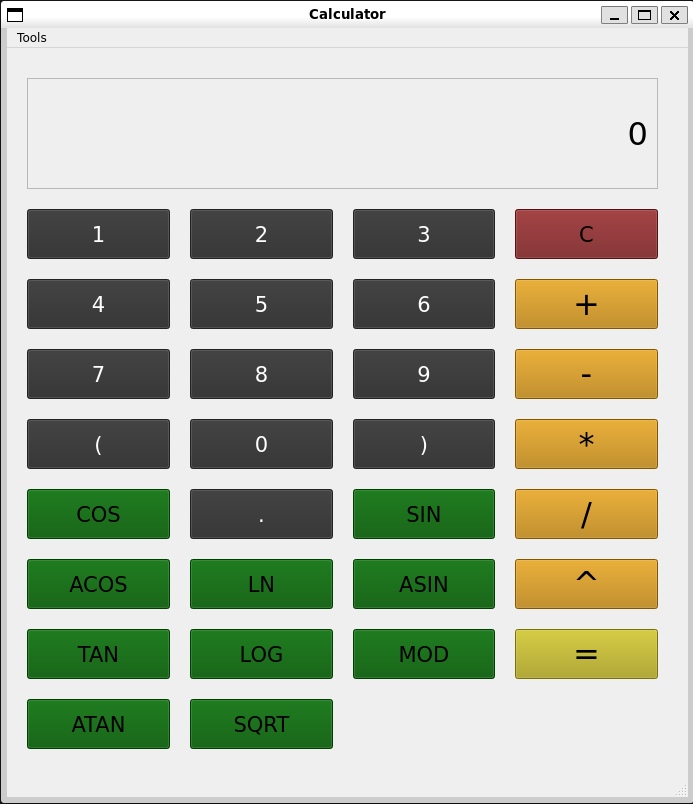
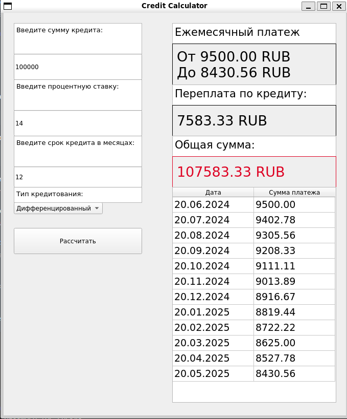
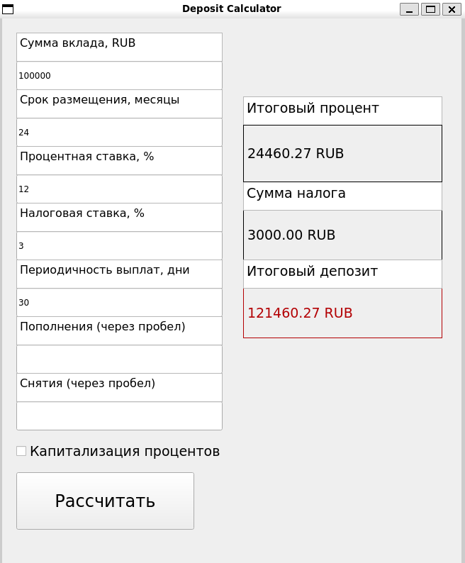

# Smart Calculator

Smart_calc is a standart calculator with functions support.\
Main logic developed in C, view part in C++ and Qt Framework. Code fully covered with unit-tests.

<div>
  
</div>
Also it has features for calculating credit payments and deposit profitability like banki.ru.<br><br>
<div>
  
  
</div>

# Usage:
1. Clone repository
```sh
git clone https://github.com/Reeskoos/qt-smart-calc
```
2. Build:
```sh
make install
```
3. Run executable:
```sh
calc
```